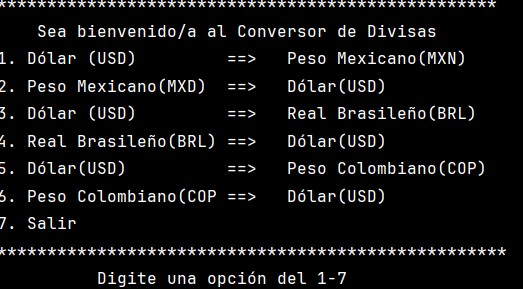
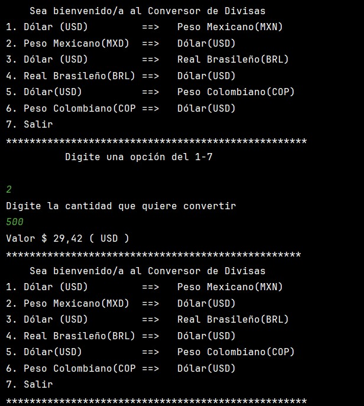
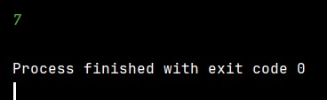

<em> CONVERSOR DE MONEDAS </em>
## Índice

- [Descripción del proyecto](#descripción-del-proyecto)
- [Estado del proyecto](#estado-del-proyecto)
- [Características de la aplicación y demostración](#características-de-la-aplicación-y-demostración)
- [Tecnologías utilizadas](#tecnologías-utilizadas)
- [Personas Desarrolladoras del Proyecto](#personas-desarrolladoras-del-proyecto)
- [Conclusión](#conclusión)

## Descripción del proyecto

Este proyecto consiste en un programa de conversión de divisas que utiliza la API de Exchange-rate para obtener los tipos de cambio en tiempo real. Los usuarios pueden seleccionar las monedas de origen y destino, ingresar la cantidad que desean convertir y obtener el resultado de la conversión, indicando la moneda a la cual fue convertida.

## Estado del proyecto

Actualmente, el proyecto es funcional, aunque pueden existir áreas de mejora y optimización expecialmente en un manejo mas exhaustivo de las excepciones. Es necesario revisar el codigo en una etapa de desarrollo 2 y agregarle nuevas funcionalidades y suprimir las lineas de codigo que no son necesarias.

## Características de la aplicación y demostración

La aplicación ofrece las siguientes características:

- Menú  para seleccionar las monedas de origen y destino.
- Conversión de divisas en tiempo real utilizando la API de Exchange-rate.
- No permite opciones no númericas en la selección del menu y la cantidad.
##Menu.

##Funcionamiento.

##Salir.
.

## Tecnologías utilizadas

El proyecto utiliza las siguientes tecnologías:

- Java
- API de Exchange-rate
- Git

## Personas Desarrolladoras del Proyecto

Este proyecto fue desarrollado por:

- [Juan Miguel Méndez Granados](#) - Desarrollador principal
- [Instrutores y colaboradores Alura](#) - Colaborador

## Conclusión

El Conversor de Divisas es una herramienta útil para realizar conversiones de moneda de manera rápida y sencilla. Me ha permitido poner en practica varios conceptos enseñados en los cursos como la pob y uso de API. Espero poder aplicar mas conceptos en futuros desarrollos. Si tienes alguna pregunta, sugerencia o problema, favor ponerse en contacto conmigo.Gracias.
